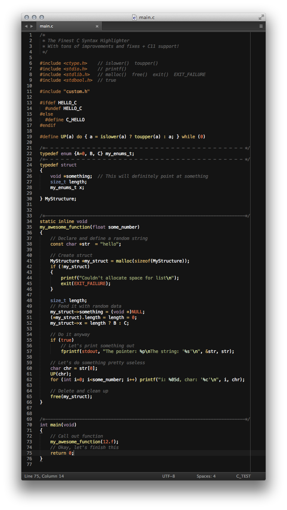

```
cutils
======

cutils is a set of very simple tools to make one's life a little easier while
one is programming in C. I created it mostly for personal usage and needs, but I
believe many will find it as useful as I do.

The following tools are included:

--------------------------------------------------------------------------------
c11.tmLanguage

    Improvements:
        - one-liner comment improved
        - trigraph sequence added
        - floats and double notations fixed
        - hexadecimal float notation added
        - operators added
        - single and double quoted strings fixed and improved
        - better type support + invalid type warnings support
        - conventional standard library typedef aliases added
        - conventional standard library constant + ellipsis support
        - special macro variables support
        - better format string support
        -

--------------------------------------------------------------------------------
cenv.py

    Sets up a minimal C environment.
    Very practical to test ideas quicly, or to start a project from scratch.


--------------------------------------------------------------------------------
cref.c

    Reference of the Standard C Library.
    It has two purposes:
    1) To be a quick reference guide, with short explanations
    2) To use it in a text editor to extend the auto complition's functionality
    THIS FILE IS NOT A VALID C FILE!


--------------------------------------------------------------------------------
ccol.h

    Single header color tools.
    Base type aliases, conversion and mixing functions, name constants and IO.


--------------------------------------------------------------------------------
cbug.h

    Lightweight debugging / logging utilities.
    This header contains 3 macros which are printing to the standard error:
        1) debug():
            has a counter + prints the location info from where it was called
        2) debugs(str):
            same as debug() + prints a single char* value
        3) debugf(fmt, ...):
            same as debug() + prints a formatted char*
    It can be turned on be defining a DEBUG constant, and will be deleted from
    the source if DEBUG is not defined.


--------------------------------------------------------------------------------
cfps.h

    Single header frame per second counter.
    It implements two inline functions:
        1) printfps(timer_func):
            it requires a timer function as it's argument which returns a double
        2) getfps(timer_func, handler_func, data_ptr):
            it is a more general purpose fps function, it requires a timer
            function which returns a double, a handler function, which will be
            called, and a pointer to any kind of data, which will be passed to
            the handler function


--------------------------------------------------------------------------------
cexc.h

    Exception handling system.
    *Coming soon...*

--------------------------------------------------------------------------------
cres.py

    Generate header files from external resources to compile them into binary.
    *Coming soon...*


--------------------------------------------------------------------------------
cdep.py

    Dependency generator (similar to make depend, but more sophisticated)
    *Coming soon...*


- - - - - - - - - - - - - - - - - - - - - - - - - - - - - - - - - - - - - - - -
Copyright (C) 2014 Peter Varo

Permission is hereby granted, free of charge, to any person obtaining a copy of
this software and associated documentation files (the "Software"), to deal in
the Software without restriction, including without limitation the rights to
use, copy, modify, merge, publish, distribute, sublicense, and/or sell copies of
the Software, and to permit persons to whom the Software is furnished to do so,
subject to the following conditions:

The above copyright notice and this permission notice shall be included in all
copies or substantial portions of the Software.

THE SOFTWARE IS PROVIDED "AS IS", WITHOUT WARRANTY OF ANY KIND, EXPRESS OR
IMPLIED, INCLUDING BUT NOT LIMITED TO THE WARRANTIES OF MERCHANTABILITY,
FITNESS FOR A PARTICULAR PURPOSE AND NONINFRINGEMENT. IN NO EVENT SHALL THE
AUTHORS OR COPYRIGHT HOLDERS BE LIABLE FOR ANY CLAIM, DAMAGES OR OTHER
LIABILITY, WHETHER IN AN ACTION OF CONTRACT, TORT OR OTHERWISE, ARISING FROM,
OUT OF OR IN CONNECTION WITH THE SOFTWARE OR THE USE OR OTHER DEALINGS IN THE
SOFTWARE.
```